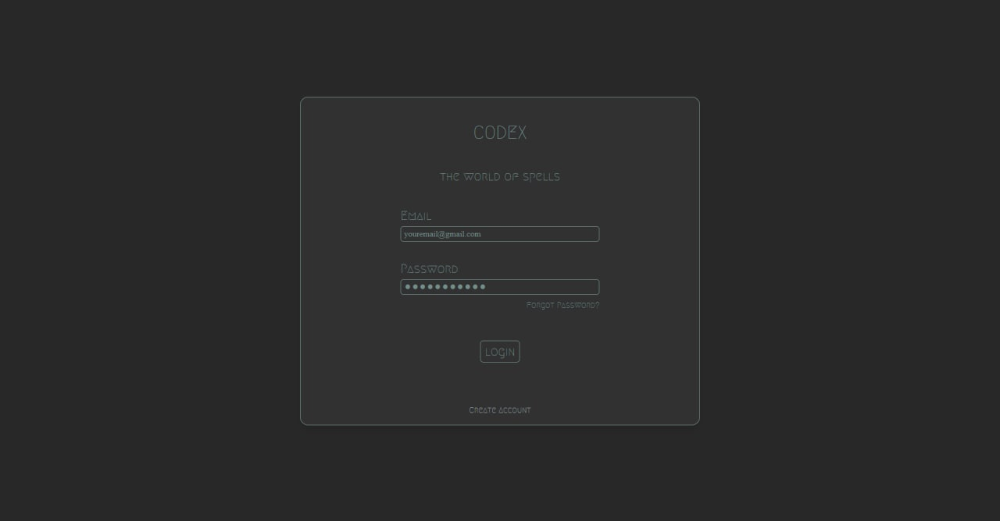
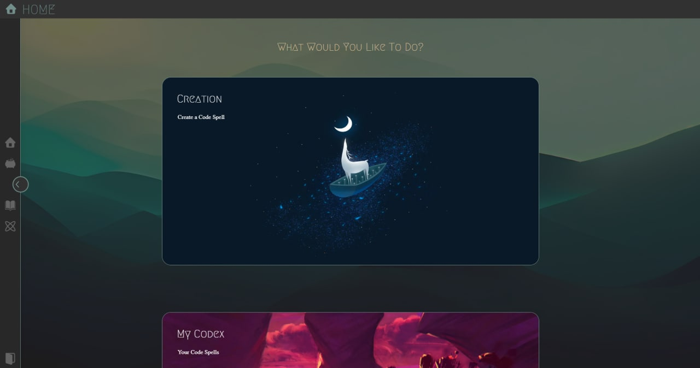
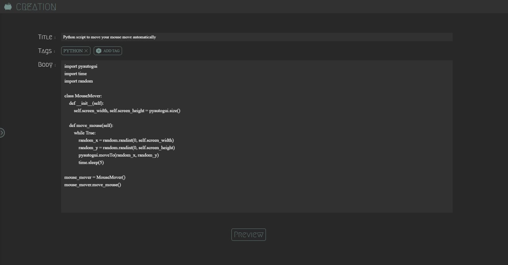
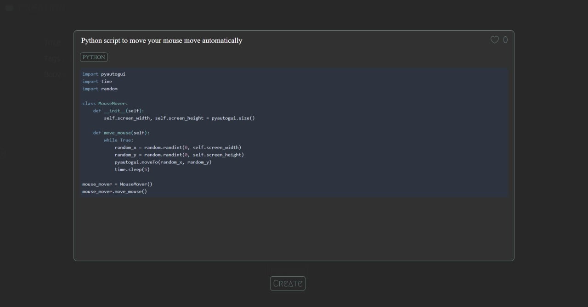
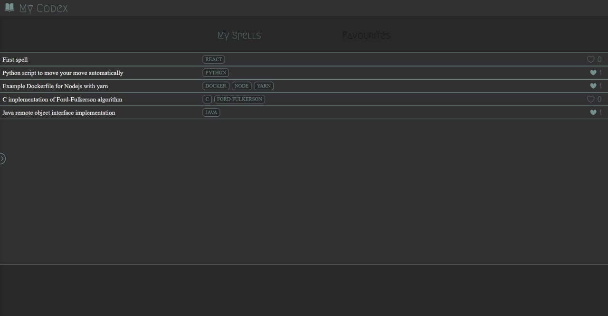
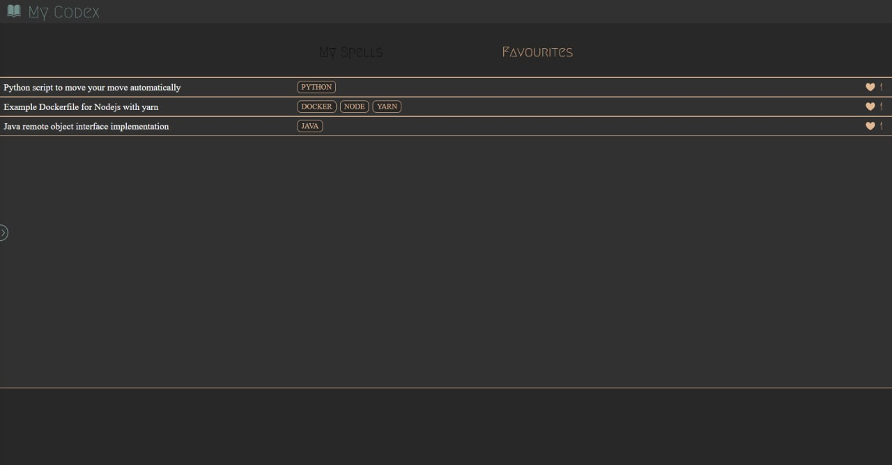
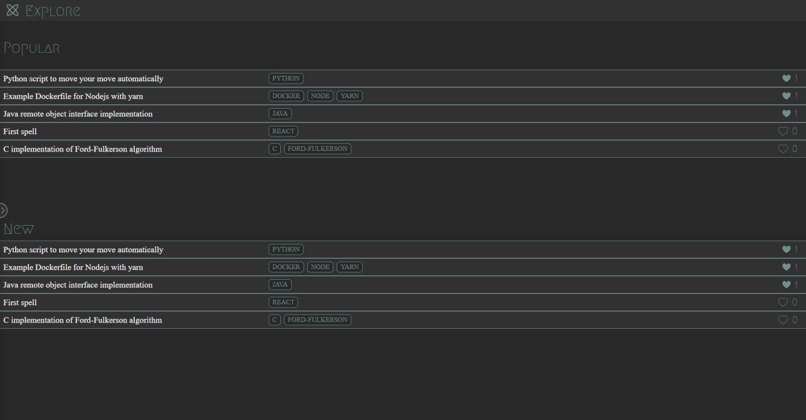

# Codex

#### A simple application to create and share coding tips with other developers!

#### Hosted on: www.codex-app.codes

## How to use

```bash
# Clone this repository
$ git clone https://github.com/Niflnir/Codex.git

# Checkout local branch
$ git checkout local

# Edit env variables in docker-compose file
  JWT_KEY: yourJWTkey
  MONGO_URI: yourMongoUri
  # USER_EMAIL and USER_PASSWORD can be empty
  # but forgot password feature will not work
  USER_EMAIL: yourGmail
  USER_PASSWORD: yourGeneratedGoogleAppPassword # Need to enable 2FA on google account and generate an app password

# Run docker-compose
$ docker-compose up -f docker-compose.yml up
```

## Features

### _Login / Create Account_

- Create account with email and password
- Login with email and password



<p align="center"><em>Login Screen with email and password</em></p>

### _Home - Navigation_
Users will be redirected to this page after **Login**. Users can navigate to **Creation**, **MyCodex** or **Explore** by clicking on the respective images or through the **Sidebar** icons. The icon at the bottom of the **Sidebar** is for users to **Logout**.


<p align="center"><em>Home screen with Sidebar open</em></p>

### _Creation - Creating a Code Spell_

A Code Spell consists of three sections:

- Title
- Tags (optional but recommended)
- Body



<p align="center"><em>Code Spell form with title, tag and code in body</em></p>

<p align="justify">After filling in the details, click on <b>Preview</b> and a preview of the Code Spell will be displayed. The code in the body will be <b>syntax highlighted</b> based on <b>Tags</b> provided. Click on <b>Create</b> after you are done reviewing the Code Spell.</p>



<p align="center"><em>Preview of Code Spell with python code and python tag</em></p>

### _My Codex - View Your Code Spells_

There are 2 tabs:

- My Spells (list of Code Spells user has created)
- Favourites (list of Code Spells user has favourited)

Code Spells are simplified, showing only the **Title**, **Tags** and the number of **Favourites**. Details of the Code Spell will be displayed upon clicking on it. User's can **Favourite** or **Unfavourite** Code Spells by toggling the :blue_heart: icon.



<p align="center"><em>My Spells tab showing user's Code Spells</em></p>

<br/>



<p align="center"><em>Favourites tab showing user's favourited Code Spells</em></p>

### _Explore- View Other User's Code Spells_

This screen will show the **Newest** and the most **Popular** Code Spells created by all the users. Users can **Favourite** or **Unfavourite** Code Spells here as well.


<p align="center"><em>Explore screen showing the newest and most popular Code Spells</em></p>

## Technologies
### Frontend: NextJS, TailwindCSS
### Backend: ExpressJS, MongoDB, Nginx
### Tools: Docker

<br/>
<br/> 

Thanks for reading!!! :smile:
